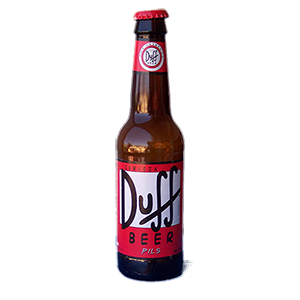

# MAKedD: World of Beers

## Summary
some text some text

### appendItemsToPage(beerArr)
```
function appendItemsToPage(beerArr) {
    $('#list-of-beers').empty();

    for(var i = currentPage*54 ; i < currentPage*54 +54 && i < beerArr.length; i++) {

        if (beerArr[i].styleId == 1){
            beerArr[i].styleId = "Classic English-Style Pale Ale";
        }
        if (beerArr[i].styleId == 2){
            beerArr[i].styleId = "English-Style Pale Ale";
        }
        if (beerArr[i].styleId == 3){
            beerArr[i].styleId = "Ordinary Bitter";

        var beerCard = "<div id=beer-card" + i + " class='col-md-2 beer-card'></div>";
        var beerContent = "<div class=beer-content" + i + "></div>";

        var nameContent = "<div id=name" + i + "></div>";
        var name = "<h5 class='name-content' >" + beerArr[i].name + "</h5>";

        var imageContent = "<div id=image" + i + " class='beer-image'></div>";
        var image = ""

        var styleContent = "<div id=style" + i + " class='style'></div>";
        var styleHeader = "<span class='style-header'>  Style: </span>";
        var style = "<span>" + beerArr[i].styleId + "</span>";

        var abvContent = "<div id=abv" + i + " class='abv'></div>";
        var abvHeader = "<span class='abv-header'>  ABV: </span>";
        var abv = "<span>" + beerArr[i].abv + "</span>";

        $('#list-of-beers').append(beerCard);
        $('#beer-card' + i).append(beerContent);        

        $('.beer-content' + i).append (nameContent);
        $('#name' +i).append(name);

        $(".beer-content" + i).append (imageContent);
        $("#image" + i).append(image);

        $('.beer-content' + i).append (styleContent);
        $('#style' +i).append(styleHeader);
        $('#style' +i).append(style);
       
        $('.beer-content' + i).append (abvContent);
        $('#abv' +i).append(abvHeader);
        $('#abv' +i).append(abv);
    }        
};
```